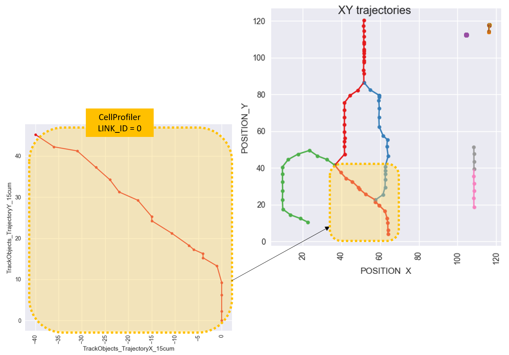

## CellProfiler example

The example in the *CellProfiler* directory was generated using the [CellProfiler software](http://cellprofiler.org/).

Because of a buggy behavior that cannot be overcome with the latest release, the software was built from source on a Windows machine with a Conda distribution, as explained in [this link](https://github.com/CellProfiler/CellProfiler/wiki/Conda-Installation).

#### Example 1

##### Input data - raw sequence
The data set used for this example is the same as the `FakeTracks.tif` used for the `TrackMate` and the `ICY` examples. The data can be downloaded from this [link](http://fiji.sc/samples/FakeTracks.tif), and it is also stored in the [input raw sequence](/example_1/input raw sequence) directory.

##### Input data - detected blobs
Before running a tracking algorithm in CellProfiler, a `detection` algorithm was applied to the `input raw sequence`. To replicate this step, and produce the data in the [input blobs sequence](/example_1/input blobs sequence) directory, you can use the CellProfiler pipeline called [blob detection](example_1/pipelines/blob_detection_log.cppipe).

Please be aware that this pipeline makes use of the [`Blob detection`](https://github.com/CellProfiler/CellProfiler/blob/master/cellprofiler/modules/blobdetection.py) module of CellProfiler, which might not be present in your version of the software.

If you want to skip this step, you can proceed with the tracking algorithm as described in the [tracking pipeline](example_1/pipelines/blobs_tracking.cppipe), using as input the detected blobs.

The CellProfiler module that writes the data to file is the `ExportToSpreadsheet` one.

##### Output produced
The [tracking pipeline](example_1/pipelines/blobs_tracking.cppipe) simply tracks the detected blobs using the `'Overlap'` method.
The trajectories are broken up in many links (41) because of the continuous swapping of object references in the segmentation/tracking.

Because CellProfiler outputs displacements and not raw coordinates (see [documentation](http://d1zymp9ayga15t.cloudfront.net/content/Documentation/cp2_manual_9978.pdf), page 233 on), the cumulative distance between successive time frames is computed and plotted:

(we barely see correspondence with the TrackMate or the ICY tracks).

If we plot the first link, we spot a map with the links produced by TrackMate:

#### Example 2
For the second example, the `Embryos` dataset from the [Object Tracking and Metadata Management CellProfiler example](http://cellprofiler.org/examples/#Tracking) is used.
In particular, the `Sequence 2` is used.

A single `pipeline` is used to detect and track the embryos, and is available [here](example_2/pipeline/cp-embryo-tracking.cppipe).

Again, the module responsible for writing the data to file is the `ExportToSpreadsheet` one ([csv file here](example_2/output/overlap15_embryos.csv)).

The [cp-output](example_2/cp-output) folder furthermore contains images produced by CellProfiler, e.g.:

.
