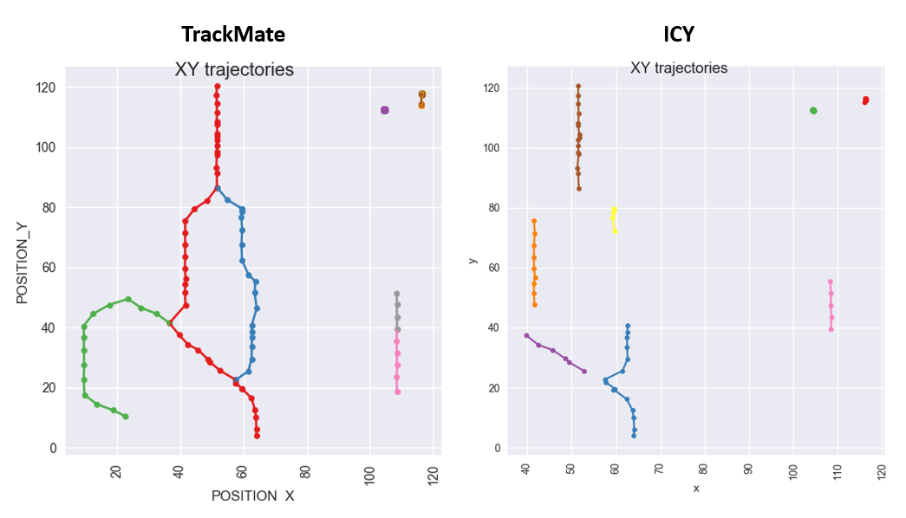

## ICY examples

The examples in the *ICY* directory were generated using the [ICY platform](http://icy.bioimageanalysis.org/).

Version used: `Icy 1.9.0.1`.

See the descriptions below for more information on each example.

#### Example 1
The dataset used in this example was generated through the [Particle tracking benchmark generator](http://icy.bioimageanalysis.org/plugin/Particle_tracking_benchmark_generator) plugin for ICY - `version 1.0.1.0`.

##### Settings for the Particle_tracking_benchmark_generator plugin
The [configuration file](example_1/particle_tracking_config.txt) contains the settings used to run the plugin.

!! Do not forget to **change the `saveDir` property from `'/Users/me/Desktop/benchmark'` to something meaningful** !!

In the interface of the `Particle_tracking_benchmark_generator` plugin load this file, and the settings will be automatically imported.
Then `run` the file, and the sequence of images/tracks generated will be both visualized and saved in the `'/Users/me/Desktop/benchmark'` directory you chose.

##### The TrackManager plugin and the Track_Processor_export_track_to_Excel
Once the data are generated, the [TrackManager](http://icy.bioimageanalysis.org/plugin/Track_Manager) plugin starts, showing the identified tracks.
In the **TrackManager** interface, click on  `add Track Processor...` and selct the [`Track Processor export track to Excel`](http://icy.bioimageanalysis.org/plugin/Track_Processor_export_track_to_Excel).

You will need to point to an Excel file (best if you use a `.xls` instead of `.xlsx` extension), and the tracks will be exported to this file.
The file will look like the [track_processor_ICY.xls](example_1/track_processor_ICY.xls) file.

##### Running the data_package library
Move to the example directory and run the data package creation script:

```
cd examples/ICY/example_1
python ../../../scripts/create_dpkg.py track_processor_ICY.xls
```

#### Example 2
The dataset used in this example is the same used in the [TrackMate examples](../TrackMate), and it can be downloaded from this [link](http://fiji.sc/samples/FakeTracks.tif).
The series of images (`FakeTracks.tif`) was analyzed through the ICY [Spot Detector](http://icy.bioimageanalysis.org/plugin/Spot_Detector) and [Spot Tracking](http://icy.bioimageanalysis.org/plugin/Spot_Tracking) plugins.

##### The Spot Detector plugin
To first identify objects of interest in the sequence of images, you need to run the *Spot Detector* plugin. Things to keep in mind when specifying settings for the detection step:

- select **Detect bright spot over dark background** in the `Detector` tab
- select **SizeFiltering** in the `Filtering tab` and set `min size = 10` and `max size = 30` (if you don't apply this filter, a lot of noise will be detected and then tracked)
- select **Export to Swimming Pool** in the `Output` tab (this pool of detections will then used in the Spot Tracking step below)

##### The Spot Tracking plugin
Once the detection step is concluded, open the *Spot Tracking* plugin.
Here, you need to select the pool of detections produced in the last step above you should have 184 detections).

You can then `Estimate parameters` for an optimal *Multiple Hypothesis Tracking* method.

Once you run the tracking, the TrackManager plugin starts, and, as for example_1 above, you can add the `processor to Export to Excel`.


##### Running the data_package library
As for the previous example, move to the example directory and run the data package creation script:

```
cd examples/ICY/example_2
python ../../../scripts/create_dpkg.py track_processor_ICY.xls
```

##### Comparing TrackMate to ICY
The two algorithms used in TrackMate and ICY on the same `FakeTracks.tif` dataset clearly behave differently, as the first allows for gaps, merges and splits, while the second results in broken trajectories:


