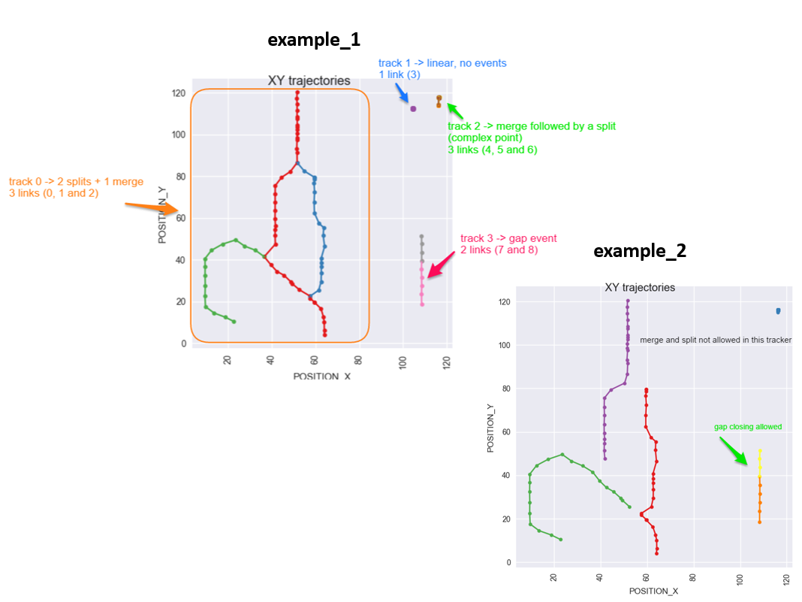

## TrackMate examples

The examples in the *TrackMate* directory were generated using the [Getting Started with TrackMate guide](http://imagej.net/Getting_started_with_TrackMate) on the official TrackMate homepage.

### The test dataset
The [test dataset](http://imagej.net/Getting_started_with_TrackMate#The_test_image) used can be uploaded in ImageJ:

`File  ▶ Open Samples  ▶ Tracks for TrackMate (807K)`

You can then open and run the TrackMate plugin selecting:

`Plugins  ▶ Tracking  ▶ TrackMate `

To reproduce the two examples in this directory, you need to choose the following settings

#### Example 1

- Segmentation with **DoG detector**,  with settings:
  - target channel: 1
  - threshold: 4.0
  - do median filtering: false
  - radius: 2.5
  - do subpixel localization: true


- Tracking with **LAP Tracker** with settings:

Linking conditions:
  - max distance: 15.0
  - no feature penalties


 Gap-closing conditions:
 - max distance: 15.0
 - max frame gap: 2
 - no feature penalties

Track splitting conditions:
 - max distance: 15.0
 - no feature penalties

Track merging conditions:
 - max distance: 15.0
 - no feature penalties

------------

#### Example 2

- Segmentation with **DoG detector**,  with settings:
  - target channel: 1
  - threshold: 5.0
  - do median filtering: false
  - radius: 5.0
  - do subpixel localization: true


  - Tracking with **LAP Tracker** with settings:

Linking conditions:
  - max distance: 15.0
  - no feature penalties

 Gap-closing conditions:
 - max distance: 15.0
 - max frame gap: 2
 - no feature penalties

Track splitting *not allowed*

Track merging *not allowed*


------------

All these settings are stored in the XML files, e.g.:
```xml

	Starting tracking using Simple LAP tracker&#xD;
	with settings:&#xD;
  	Linking conditions:&#xD;
    - max distance: 15.0&#xD;
    - no feature penalties&#xD;
	Gap-closing conditions:&#xD;
    - max distance: 15.0&#xD;
    - max frame gap: 2&#xD;
    - no feature penalties&#xD;
	Track splitting not allowed.&#xD;
	Track merging not allowed.&#xD;
------------

#### Differences in the pipelines
Look at the **plots** in the directory to have a quick view of the identified links (see this [page](https://cellmigstandorg.github.io/Tracks/) for the definition of a link).

Comparing the two plots, you can see immediately that the pipeline used for  *example_1* allowed for splitting and merging, while the one used for *example_2* did not:



